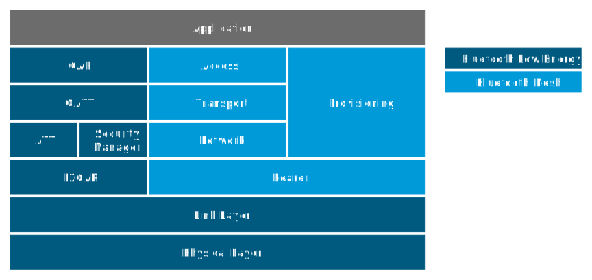
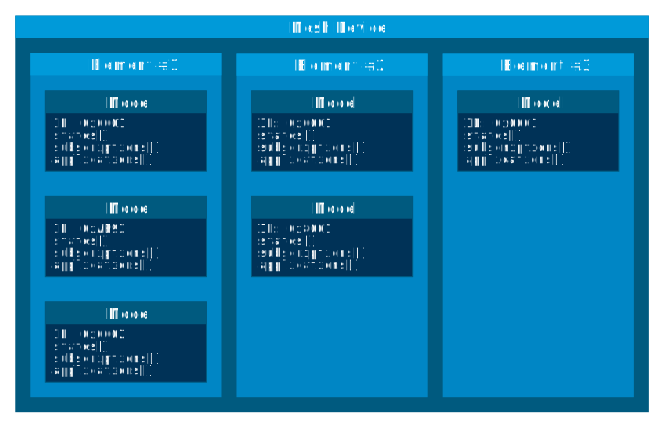

# Basic Bluetooth Mesh concepts

The Bluetooth Mesh is a profile specification developed and published by the @link_BluetoothSIG<!--http://www.bluetooth.org/-->. This document explains the basic concepts of the Bluetooth Mesh and gives an overview of the operation and capabilities of the profile, as well as explaining the life cycle of a mesh device. For information about Nordic Semiconductor's implementation of the Bluetooth Mesh, see the [mesh architecture documentation](@ref md_doc_getting_started_basic_architecture).

## Relation to Bluetooth low energy

The Bluetooth Mesh is based on the Bluetooth low energy part of the Bluetooth 4.0 Specification and shares the lowest layers with this protocol. On-air, the Bluetooth Mesh packet format and physical representation is compatible with existing Bluetooth low energy devices, and the Mesh protocol acts entirely in the payload space of Bluetooth low energy _Advertisement_ packets. The Bluetooth Mesh specifies a completely new host layer, and although some concepts are shared, the Bluetooth Mesh is incompatible with the Bluetooth low energy host layer.

## Application areas

The Bluetooth Mesh primarily targets simple control and monitoring applications, like light control or sensor data gathering. Its packet format is optimized for small control packets, issuing single commands or reports, and is not intended for data streaming or similar high-bandwidth applications.

The Bluetooth Mesh requires a higher power consumption than traditional Bluetooth low energy applications, and unlike Bluetooth low energy Advertiser devices, active mesh devices cannot be run off coin-cell batteries for extended periods of time.

The Bluetooth Mesh has a hard limit of 32767 devices in a network and a maximum network diameter of 126 hops.

## Network topology and relaying

The Bluetooth Mesh is a broadcast-based network protocol, where every device in the network sends and receives all messages to and from all devices within radio range. There is no concept of connections in the network topology, and any device in the network may relay the messages from any other device. This property allows devices to move around and drop in and out of the network without having to compensate for the change in topology.

### Mesh transport

As mentioned in the _Relation to Bluetooth low energy_ section, the Bluetooth Mesh's lower layers are shared with Bluetooth low energy. Specifically, the Bluetooth Mesh utilizes the Bluetooth low energy Advertiser and Scanner roles, communicating through Bluetooth low energy advertisement packets. The mesh advertisement packets are picked up by nearby mesh devices and handled like other Bluetooth low energy advertisement packets. The mesh packets are represented with a unique AD type and added to the advertisement packet payload.

Bluetooth low energy devices send advertisement packets at regular _advertisement intervals_, and the mesh packets are no exception. Unlike traditional advertisers, mesh devices will change their advertisement payload on every transmission, broadcasting new mesh packets as they are queued up in the stack. Every Bluetooth Mesh advertisement is transmitted only once for every device, and if there is no traffic in the mesh, the devices stay silent.

### Relays

The Bluetooth Mesh expands the range of the network by relaying messages. Any mesh device may be configured to act as a relay, and no dedicated relay devices are needed to build a network. Every device acting as a relay will decrement the Time To Live (TTL) value in the received message and forward the message if its TTL value was >= 2. This undirected relaying is referred to as message _flooding_ and ensures a high probability of message delivery, without requiring any information on network topology. The Mesh Profile Bluetooth Specification does not provide any routing mechanisms, and all messages are forwarded by all relays until they exhaust their TTL value. To avoid messages being forwarded by the same relays over and over, all mesh devices maintain a message cache. This cache is used for filtering out packets that the device has already handled.

The flooding based approach to message relaying can cause a lot of redundant traffic on air, which may impact the throughput and reliability of the network. While all devices in a network may act as relays, it is highly recommended to limit the number of relays to restrict this effect. The rate of relay-enabled devices in the network is a trade-off between message route-redundancy and reliability. It should be tuned according to network density, traffic volumes, network layout, and requirements to reliability and responsiveness.

### Power consumption

To enable the broadcast-based communication, the devices must keep their radio in listening mode for most of the time, causing significantly higher power consumption than in a typical Bluetooth low energy device. To enable low power devices to take part in the mesh network, the Bluetooth Mesh has a low power _Friendship_ protocol. This protocol lets low power devices establish a relationship with a regular mesh device and participate in the mesh network through this device.

### GATT proxy

To enable support for legacy Bluetooth low energy devices, the Bluetooth Mesh has a separate protocol for tunneling mesh messages over the Bluetooth low energy GATT protocol. This low power one-to-one transport allows non-mesh devices to participate in the network by establishing a connection to a mesh device. In this mode, as well as the Friendship mode mentioned before, the non-mesh device gets assigned an address, and it is a full-fledged member of the network. The mesh security also extends to this device, and it does not have to expose any encrypted information to the mesh device to which it is connected.

## Addressing

The Bluetooth Mesh addressing scheme is separate from the Bluetooth low energy addressing scheme. It features three types of addresses:

- Unicast addresses: unique for every device
- Group addresses: allow forming a group of devices and address them all at once
- Virtual addresses: untracked UUID-based addresses with a large address space

When a device is added to a network, it is assigned a range of unicast addresses that represents it. A device's unicast addresses cannot be changed and are always sequential. The unicast address space supports 32767 unicast addresses in a single mesh network. Unicast addresses are primarily used for device configuration and diagnostic collection, but they can be used by any application to address devices directly.

The group addresses are allocated and assigned as part of the network configuration procedure. A group address may represent any number of devices, and a device may be part of any number of groups. There can at most be 16127 general purpose group addresses in a mesh network.

The virtual addresses can be considered special group addresses, which can represent any number of devices. Each virtual address is a 128-bit label UUID that does not have to be tracked by a network configuration device. In this way, users can generate virtual addresses prior to deployment or ad-hoc between devices in the network at runtime.

## Mesh access layer

To standardize communication between devices from different vendors, the Mesh Profile Bluetooth Specification defines a mesh access layer.

The access layer holds a set of mesh models arranged in elements, as illustrated in the following figure.

Every device has one or more elements, each acting as a virtual entity in the mesh with its own unique unicast address. Every element holds one or more models. A model represents a specific behavior or service and defines a set of states and messages that act on these states. The Bluetooth SIG defines a set of models to cover typical usage scenarios like device configuration, sensor reading, and light control, but vendors are free to define their own models with accompanying messages.

Each incoming message is handled by one model instance in an element. Therefore, to make it possible to uniquely resolve how messages are handled, only one model instance per element can implement a handler for a specific message. If a device has multiple instances of the same model, each instance must be assigned to a separate element. Similarly, if two models implement handlers for the same message, these models must be in separate elements.

To represent complex behavior with minimal message and state duplication, models may be made up of multiple other models, potentially spanning multiple elements. These models are referred to as extended models. Models that are purely self-contained are referred to as root models.

Models talk to each other through a publish and subscribe system. Every model may subscribe to a set of group and virtual addresses, and the model will only handle messages that are published to one of its subscription addresses or the containing element's unicast address. Any model may maintain a publish address that it publishes messages to. This publish address can be of any type.

## Provisioning

Before a device can participate in normal mesh operation, it must be provisioned. During provisioning, a device gets added to the network and is assigned a range of unicast addresses, a network key, and a device key. The provisioning is done by a _Provisioner_, which is a trusted device with access to the full list of devices in the network and their addresses. After the new device has been provisioned, the Provisioner is expected to use the new device's device key to configure it.

## Configuring the network

The Bluetooth Mesh leaves the network configuration to a central network configurator. Devices are not expected to do any sort of service discovery on their own. To control other devices, a device like a light switch must be configured through user interaction (or a predetermined configuration from a database). Every device must implement a mandatory Configuration Server model in their first element, which can be used to configure the rest of its models.

As soon as provisioning is complete, the provisioner (or some other master device) uses its instance of the Configuration Client model to give the new device a set of application keys and addresses. The device will use these keys and addresses for the duration of its lifetime on the network, unless it gets reconfigured.

### Example scenario: Light switch

After a new light switch has been provisioned, the Configuration Client model in the provisioner reads out a list of the new device's models and elements and presents them to the user. The user finds the light switch model in the device model list and gives it the "Light Control" application key. Next, the user sets its publish address to the "Kitchen Area" group address, to which all the light bulbs in the kitchen subscribe. The next time the new light switch is pressed, all light bulbs in the kitchen turn on.

## Security

The Bluetooth Mesh employs several security measures to prevent third-party interference and monitoring.

### Authentication

Device authentication is part of the network building process (the provisioning) and lets the user confirm that the device being added is the device they think it is, and not an impostor. The specification defines a range of local out-of-band authentication methods (for example, blinking of lights, output and input of passphrases, and static authentication against an external resource like a product database). When a device has been provisioned, it is part of the network and all its messages are considered authenticated. To secure the provisioning procedure, Elliptic Curve Diffie-Helmann (ECDH) public key cryptography is used.

### Encryption

The Bluetooth Mesh features two levels of AES-CCM encryption with 128-bit keys for all messages going across the network.

The lowest layer, _network encryption_, protects all devices in the network from outside access, while implicitly defining which devices are part of the network. Network encryption is done with a network encryption key, and any network may have up to 4096 different network keys. All devices with a network key are considered part of the network and may send and relay messages across it. By using multiple network keys, a network administrator may effectively separate their network into multiple subnetworks, because a mesh relay forwards only messages that are encrypted with a known network key.

The second encryption layer is the _transport encryption_. This encryption layer limits which devices can do what _within a network_ through an application or device key. As an example, consider a mesh network deployed in a hotel, where it is desirable to limit some features to be controlled by the staff (like configuration of key cards or access to storage areas) and some features to be available to guests (like controlling room lighting or air conditioning). For this, we can have one application key for the guests and one for the staff, with their messages traveling across the same network with the same network key.

While application keys are used to separate access rights to different applications in the network, the device keys are used to manage devices in the network. Every device has a unique device key, which is only known to the network configuration device and the key owner. The device key must be used when giving a device new encryption keys (network or application keys) or addresses. It can also be used to evict malicious devices from a network by transferring a new set of keys to all devices (with their individual device keys), except for the malicious device. This process is referred to as Key Refresh Procedure in the Mesh Profile Bluetooth Specification.

Each encrypted mesh message contains 32-bit or 64-bit message integrity check values that validate that the content of the message was encrypted with the indicated encryption keys.

### Privacy

All mesh message payloads are fully encrypted. Message metadata like source address and message sequence number is obfuscated with the privacy key, derived from the network key.

### Replay protection

To guard against malicious devices replaying previous messages, every device keeps a running sequence number, and each mesh message is sent with a unique pair of sequence number and source address. When receiving a message, the receiving device stores the sequence number and makes sure that it is more recent than the last sequence number it received from the same source address.
